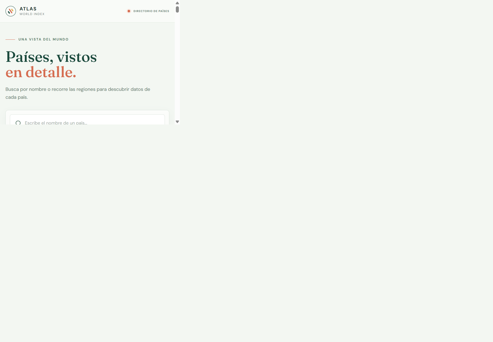

# Atlas | Explorador de países

Aplicación independiente en Vanilla TypeScript para consultar países mediante tarjetas, búsqueda por nombre, filtro por región y vista de detalle.

## Requisitos

- Node.js 20.19+ o 22.12+
- pnpm

## Instalar y ejecutar

```sh
cd explorer-app-lab-3
pnpm install
pnpm dev
```

Vite mostrará la URL local, normalmente `http://localhost:5173`. Para compilar y revisar la versión de producción:

```sh
pnpm build
pnpm preview
```

## Fuente de datos

La actividad usa el JSON local facilitado por la docente en `public/countries.json`, porque existe un límite de consultas a la API. La aplicación conserva la petición `fetch('/countries.json')`, verifica el estado HTTP y valida en tiempo de ejecución los datos recibidos antes de aceptarlos como `Country[]`. Un error HTTP, JSON mal formado o estructura incompatible muestra el estado de error con opción para reintentar.

## Organización del código

- `src/api/`: petición `fetch` y validación del JSON de países.
- `src/types/`: interfaces TypeScript de país y estado de la aplicación.
- `src/utils/`: filtro combinado, formato y debounce cancelable de 300 ms.
- `src/render/`: tarjetas, detalle y estados de carga, vacío y error.
- `src/main.ts`: carga inicial, eventos, actualización de resultados y navegación.
- `public/countries.json`: fuente local de la actividad.

La búsqueda no distingue mayúsculas ni acentos. Cada cambio de texto cancela el debounce anterior; cambiar región actualiza los resultados inmediatamente y conserva el texto de búsqueda.

## Versión de entrega

La versión Vanilla TypeScript se conserva en la rama [`entrega-lab-3`](https://github.com/josehrdez127-hue/Dise-o-web-/tree/entrega-lab-3/explorer-app-lab-3).

## Captura

